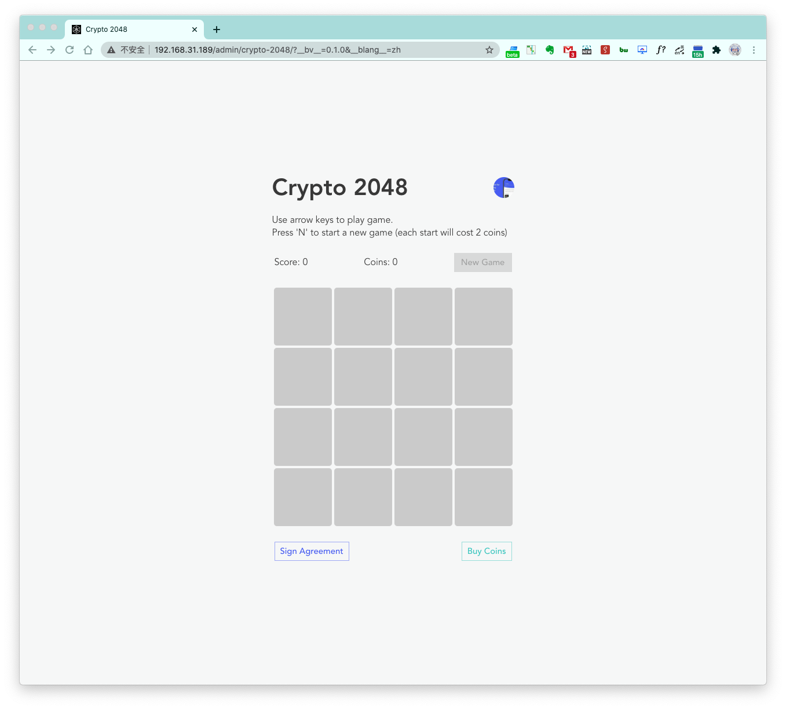

# Crypto 2048

In this developer workshop, ArcBlock's team will walk you through how to build a blockchain game using ArcBlock's ABT Node, Blocklets, and ArcBlock SDK.

Reference materials can be found:

- Slide: https://devcon2020-videos.s3-us-west-2.amazonaws.com/Workshop-building-a-blockchain-game-blocklet-with-forge-sdk.pdf
- Video:
  - Chinese
    - Part1: https://devcon2020-videos.s3-us-west-2.amazonaws.com/workshop-blockchain-part1-zh.mp4
    - Part2: https://devcon2020-videos.s3-us-west-2.amazonaws.com/workshop-blockchain-part2-zh.mp4
  - English:
    - Part1: https://devcon2020-videos.s3-us-west-2.amazonaws.com/workshop-blockchain-part1-en.mp4
    - Part2: https://devcon2020-videos.s3-us-west-2.amazonaws.com/workshop-blockchain-part2-en.mp4

The video includes walk through guides that include:

## Agenda

- Basic Requirements
- Game design and background knowledge
- Game features preview in wallet playground
- Dapp bootstrapping with sample project
- Game feature implementation
- Game publish as a blocklet

## Basic Requirements

- Local [ABT Node](https://www.arcblock.io/en/node) instance up and running
- [ABT Wallet](https://abtwallet.io) installed and setup on your phone
- Basic programming knowledge, and command line operations
- Can write code with [Javascript](https://developer.mozilla.org/en-US/docs/Web/JavaScript), better know some [React](https://reactjs.org/)
- [Mongodb](https://www.mongodb.org/) up and running, `brew install mongodb`

## Game design: UI

## Game design: Rules

- Simple game that user combines tiles to achieve higher score
- User need to login with ABT Wallet
- User need to pay game coins to start a new game
- Game coins are bought with native ABT token
- User can get badges when he achieved a high score on record

## Background knowledge: Atomic Swap

- Why: atomic swap is used to move data across different chains in a secure way
- What: both token and assets can be swapped
- How: [@arcblock/did-auth](https://www.npmjs.com/package/@arcblock/did-auth)

## Background knowledge: NFT

- Why: Everything will be digitalized on blockchain or somewhere else
- What: Non-Fungible-Token, anything that's not token, such as certificate/badge/ticket
- How: [@arcblock/nft](https://www.npmjs.com/package/@arcblock/nft)

## Wallet playground setup and demo

- Setup local chain
- Setup foreign chain
- Setup blockchain explorer
- Setup wallet-playground

## Project bootstrapping

- Get the [sample starter project](https://github.com/ArcBlock/workshop-blockchain-game)
- Install dependencies
- Create .env file
- Declare your dapp with `node tools/declare.js`
- Found the dapp with game coins from ABT Wallet
- Get some native token from `boarding-gate` in ABT Wallet
- Start the dapp

## Game implementation: buy coins

- 1 Native Token (TBA) = 100 Game Coin (PLAY)
- Add `@arcblock/did-auth` and `@arcblock/did-react`
- Add atomic-swap backend handler
- Add atomic-swap frontend

## Game implementation: authorization

- Just like adding a credit card
  - User authorize game to charge on starting new game
  - The authorization is signed by user and saved on blockchain
- Add `@arcblock/did-util` and `@arcblock/tx-util`
- Add authorization backend handler
- Add authorization frontend

## Game implementation: payment

- Add backend api for start game: which charge user for 2 coins
- Improve `onGameStart` on frontend:
  - Call backend api when start game
  - Show loading indicator when call api
  - Refresh session when payment is done

## Game implementation: badge

- Prepare badge template
- Add `@arcblock/nft` and `@arcblock/nft-template`
- Add `trophy` handler on backend
  - Create badge for user when request
  - Transfer badge for user when claim the trophy
- Add `onGameOver` on frontend
  - Enable trophy claim when game score is larger than 1024

## Game publish as a blocklet: init

- `abtnode blocklet:init`: update meta data
  - Add `main`
  - Add `provider`
  - Add `requiredEnvironments`
  - Add `public_url`

## Game publish as a blocklet: bundle

- `abtnode bundle`: bundle the blocklet
  - Add bundle scripts
  - Test bundle scripts

## Game publish as a blocklet: deploy

- Add `pre-start` hook which does following work
  - Declare game account on chain
  - Get some game coin into the game account
- `abtnode deploy`: deploy to local ABT Node
  - Add pre-deploy hook

## Game publish as a blocklet: publish

- Update publish config
- Publish to npm registry
- Publish to blocklet registry

## Credits

- 2048 game prototype on [codepen](https://codepen.io/jeffleu/pen/JRzyPZ)
- Trophy svg downloaded form [here](https://www.svgrepo.com/download/241749/trophy-cup.svg)
